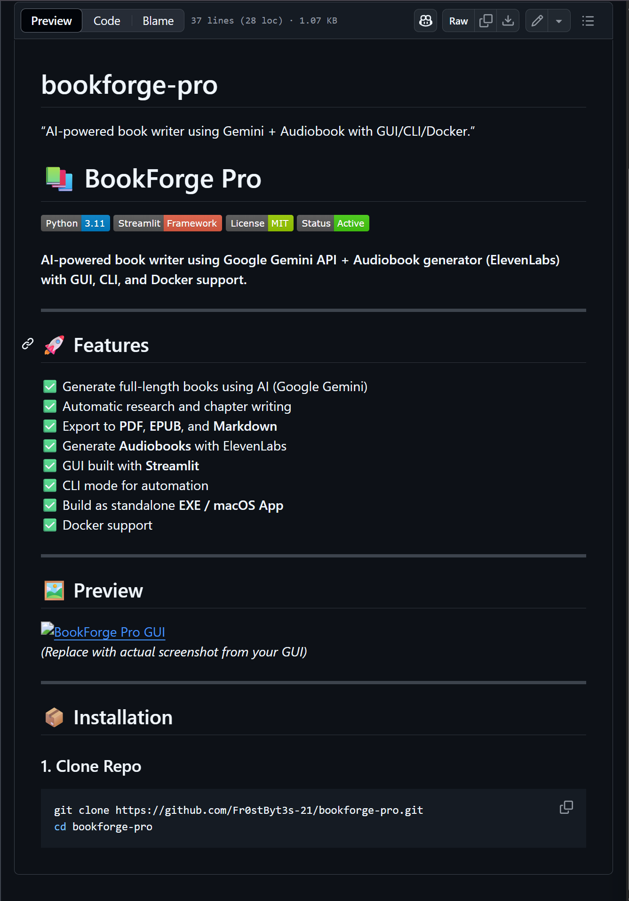

# 📚 BookForge Pro


**AI-powered book writer using Google Gemini API + Audiobook generator (ElevenLabs) with GUI, CLI, and Docker support.**

---

## 🚀 Features
✅ Generate full-length books using AI (Google Gemini)  
✅ Automatic research and chapter writing  
✅ Export to **PDF**, **EPUB**, and **Markdown**  
✅ Generate **Audiobooks** with ElevenLabs  
✅ GUI built with **Streamlit**  
✅ CLI mode for automation  
✅ Build as standalone **EXE / macOS App**  
✅ Docker support  

---

## 🖼 Preview
  
*(Replace this with actual screenshot from your GUI later)*

---

## 📦 Installation

### 1. Clone Repo
```bash
git clone https://github.com/Fr0stByt3s-21/bookforge-pro.git
cd bookforge-pro
